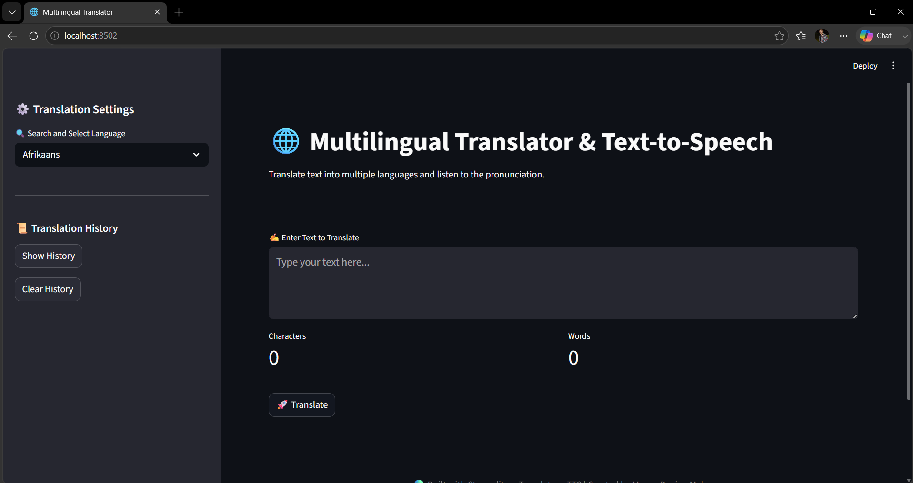
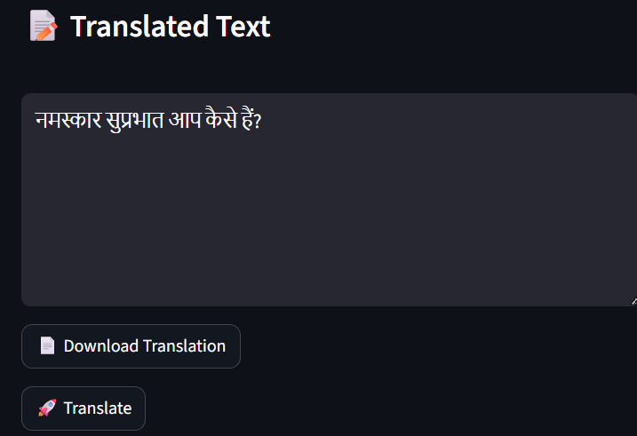

# 🌐 Multilingual Translator & Text-to-Speech

A professional NLP-based web application built with **Streamlit**, **mTranslate**, and **gTTS** that translates text into multiple languages and converts translated text into speech.
\

---

## 🚀 Features

* 🌍 Translate text into multiple languages
* 🔍 Search and select target language
* 🔊 Text-to-Speech (TTS) generation
* 📥 Download translated text
* 🎵 Download generated audio
* 📊 Character and word counter
* 📜 Translation history tracking
* 🧹 Clear translation history
* 🎨 Modern and responsive Streamlit UI
* 🌐 Odia language translation support
* ⚡ Fast translation powered by mTranslate

---

## 🖼️ Application Preview

### Home Screen



### Translation Output



---

## 📂 Project Structure

```text
Multilingual-Translator-TTS/
│
├── app.py
├── language.csv
├── requirements.txt
├── README.md
│
└── images/
    ├── home.png
    └── translation_output.png
```

---

## 🛠️ Technologies Used

* Python
* Streamlit
* Pandas
* mTranslate
* gTTS

---

## 📦 Requirements

```text
streamlit
pandas
mtranslate
gTTS
```

Install manually:

```bash
pip install streamlit pandas mtranslate gTTS
```

---

## 🌍 Supported Features

| Feature              | Status                    |
| -------------------- | ------------------------- |
| Text Translation     | ✅                         |
| Text-to-Speech       | ✅                         |
| Audio Download       | ✅                         |
| Translation Download | ✅                         |
| Translation History  | ✅                         |
| Character Counter    | ✅                         |
| Word Counter         | ✅                         |
| Odia Translation     | ✅                         |
| Odia Audio Output    | ❌ (Not supported by gTTS) |

---

## 📸 Example

**Input:**

```text
Hello..
Good Morning..
```

**Language Selected:**

```text
Hindi
```

**Output:**

```text
हैलो सुप्रभात...
```

---

## 🔮 Future Enhancements

* 🎤 Speech-to-Text Input
* 🤖 Automatic Language Detection
* 🌙 Dark Mode Toggle
* 🔊 Voice Selection (Male/Female)
* 📊 Translation Analytics Dashboard
* ☁️ Streamlit Cloud Deployment
* 🐳 Docker Support
* 📁 Export Translation History as CSV

---

## 👨‍💻 Author

**Manas Ranjan Meher**

* GitHub: https://github.com/manasranjanmeher99/
* LinkedIn: https://www.linkedin.com/in/manas-ranjan-meher-606181280/

---

## ⭐ Support

If you found this project useful, consider giving it a **Star ⭐** on GitHub.
